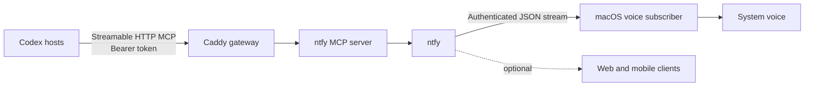

<div align="center">
  
  <h1>Let Agent Speak</h1>
  <p><strong>Your agent speaks when it’s done — or when it needs you.</strong></p>
  <p>A private, self-hosted voice notification bridge for AI agents on your trusted local network.</p>

  <p>
    <a href="https://github.com/Seker800/LetAgentSpeak/actions/workflows/validate.yml"></a>
    <a href="LICENSE"></a>
    
    
    
  </p>

  <p><a href="README.zh-CN.md">简体中文</a> · <a href="#quick-start">Quick start</a> · <a href="#security-model">Security</a> · <a href="CONTRIBUTING.md">Contributing</a></p>
</div>

---

Let Agent Speak gives every AI agent host on your trusted LAN one small, consistent way to get your attention. At the end of each task—or when the agent genuinely needs you—the server Mac speaks a short outcome aloud. No phone, open browser, or cloud notification account is required.

It assembles three focused, replaceable components:

- [ntfy](https://github.com/binwiederhier/ntfy) stores and delivers notifications.
- [ntfy-mcp-server](https://github.com/cyanheads/ntfy-mcp-server) exposes the notification tool to Codex.
- [Caddy](https://github.com/caddyserver/caddy) protects the LAN-facing MCP endpoint with a bearer token.

## Why Let Agent Speak?

- **Walk away from tasks.** Hear a concise outcome when Codex finishes work or needs you to unblock it.
- **A clear voice contract.** The included agent policy defines useful completion and blocker messages while keeping intermediate updates silent.
- **Private by default.** Services run on your own machine, anonymous ntfy access is denied, and generated credentials never enter Git.
- **Works across Codex clients.** Desktop, CLI, and IDE clients connect through standard Streamable HTTP MCP.
- **Failure-aware.** An optional Codex completion hook provides an independent fallback when every completed turn must produce a notification.
- **Built from replaceable parts.** The speech subscriber depends only on ntfy's HTTP stream, so the backend can evolve without changing Codex clients.

## How it works



Caddy is the only published MCP endpoint. The upstream MCP container stays inside Docker's private network, while ntfy grants one generated user access to one generated topic.

## Quick start

### Requirements

- A Mac that stays online on your trusted local network
- Docker with Docker Compose
- `curl`, `jq`, and `openssl`

Clone the repository, then run:

```bash
git clone https://github.com/Seker800/LetAgentSpeak.git
cd LetAgentSpeak
make init
make voice-install
```

`make init` detects the Mac's LAN address, creates random credentials, starts the pinned containers, configures least-privilege ntfy access, generates a Codex client snippet, and runs an end-to-end smoke test.

`make voice-install` installs a per-user macOS LaunchAgent. It reconnects automatically, subscribes to your private topic, and speaks messages with `/usr/bin/say`.

Try it immediately:

```bash
make voice-test
```

> [!WARNING]
> The default deployment uses HTTP and is designed only for a trusted home or studio LAN. Never forward its ports from your router. Use a VPN such as Tailscale/WireGuard or a trusted HTTPS reverse proxy on an untrusted network.

## Connect Codex

After initialization, copy the generated snippet from `runtime/codex-config.toml` into `~/.codex/config.toml` on each Codex host, then restart that Codex client.

Add the policy in [`client/AGENTS.notification.md`](client/AGENTS.notification.md) to the host's global `~/.codex/AGENTS.md`. It gives Codex a stable contract for concise completion outcomes, concrete blocker messages, explicit alert requests, and silence during intermediate or repeated updates. An explicit request to stay quiet overrides the default for that task.

Codex Desktop, CLI, and IDE clients on the same host share the MCP configuration. Each additional LAN machine needs its own client setup.

## Optional guaranteed completion hook

MCP tool calls are initiated by the model, so they cannot guarantee a notification after every turn. If every completed Codex turn must produce an alert, install [`client/codex-notify.sh`](client/codex-notify.sh) on that host and configure:

```toml
notify = ["/absolute/path/to/codex-notify.sh"]
```

The hook reads `SEKER_NTFY_URL`, `SEKER_NTFY_TOPIC`, `SEKER_NTFY_USER`, and `SEKER_NTFY_PASSWORD` from its environment. If you already use a `notify` command, call both commands from a wrapper rather than replacing the existing one.

## Security model

| Boundary | Default protection |
| --- | --- |
| MCP entry point | Caddy requires a generated 256-bit bearer token |
| Upstream MCP server | Private Docker network; no host port is published |
| ntfy access | Anonymous access denied; generated user restricted to one random topic |
| Network exposure | Published ports bind to the detected LAN address |
| Secrets | Stored in ignored `.env` and generated `runtime/` files with restrictive permissions |
| Dependency drift | Container versions are pinned and checked before upgrades |

For the full trust-boundary and reliability design, read [`docs/ARCHITECTURE.md`](docs/ARCHITECTURE.md). To report a vulnerability, follow [`SECURITY.md`](SECURITY.md) instead of opening a public issue.

## Configuration

Copy `.env.example` to `.env` only when automatic LAN detection is unsuitable. `make init` normally creates this file for you.

| Variable | Purpose | Default |
| --- | --- | --- |
| `LAN_HOST` | LAN address used for published ports | auto-detected |
| `MCP_PORT` | Authenticated MCP gateway port | `3010` |
| `NTFY_PORT` | ntfy subscriber port | `8080` |
| `NTFY_UPSTREAM_BASE_URL` | Optional upstream poll relay for timely iOS delivery | empty |
| `SEKER_VOICE` | Installed macOS system voice | `Tingting` |
| `SEKER_VOICE_RATE` | Speech rate, from 80 to 500 | `190` |

List installed macOS voices with `say -v '?'`. After changing the voice or rate, run `make voice-install` again.

### iPhone delivery

Pure LAN self-hosting may delay notifications when an iPhone is locked. For timely push delivery, set:

```dotenv
NTFY_UPSTREAM_BASE_URL=https://ntfy.sh
```

Then run `make up`. The upstream receives only a poll request, not the notification body; the phone must still be able to reach your LAN ntfy server.

## Operations

| Command | Purpose |
| --- | --- |
| `make status` | Show container status |
| `make logs` | Follow service logs |
| `make check` | Validate shell syntax, Compose config, and secret exclusions |
| `make smoke` | Run authentication, MCP handshake, publish, and readback checks |
| `make client-config` | Regenerate the Codex configuration snippet |
| `make voice-status` | Inspect the macOS voice subscriber |
| `make voice-test` | Publish a spoken test message |
| `make voice-uninstall` | Remove the voice LaunchAgent |
| `make down` | Stop the containers |

## Project principles

Let Agent Speak is intentionally small. It aims to remain easy to deploy, private by default, dependable enough for long-running agent work, and loosely coupled to any single client or notification platform. The complete product direction lives in [`docs/NORTH_STAR.md`](docs/NORTH_STAR.md).

## Contributing

Bug reports, documentation improvements, and focused pull requests are welcome. Start with [`CONTRIBUTING.md`](CONTRIBUTING.md) and follow the [`CODE_OF_CONDUCT.md`](CODE_OF_CONDUCT.md).

## Acknowledgements

Let Agent Speak is an integration project built on the excellent work of [ntfy](https://github.com/binwiederhier/ntfy), [ntfy-mcp-server](https://github.com/cyanheads/ntfy-mcp-server), and [Caddy](https://github.com/caddyserver/caddy).

## License

Released under the [MIT License](LICENSE).
