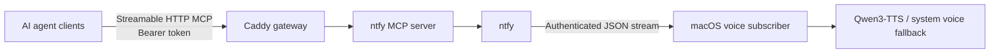

<div align="center">
  
  <h1>Let Agent Speak</h1>
  <p><strong>Your agent speaks when it’s done — or when it needs you.</strong></p>

  <p>
    <a href="https://github.com/Seker800/LetAgentSpeak/actions/workflows/validate.yml"></a>
    <a href="LICENSE"></a>
    
    
  </p>

  <p><a href="README.zh-CN.md">简体中文</a> · <a href="#quick-start">Quick start</a> · <a href="#security-model">Security</a> · <a href="CONTRIBUTING.md">Contributing</a></p>
</div>

---

Let Agent Speak gives coding agents a voice through your Mac. When a task finishes, or when the agent needs you to do something, the Mac reads out one short message. You do not have to keep watching the terminal.

It works with Codex, Claude Code, OpenClaw, and other clients that support Streamable HTTP MCP. Everything runs on your own network:

- [ntfy](https://github.com/binwiederhier/ntfy) carries the message.
- [ntfy-mcp-server](https://github.com/cyanheads/ntfy-mcp-server) gives agents a tool for sending it.
- [Caddy](https://github.com/caddyserver/caddy) checks the access token before accepting MCP connections.

## Why use it

- **Stop watching the agent.** Your Mac tells you when work completes, fails, or needs a concrete action.
- **Natural local Chinese speech.** Apple Silicon Macs can run Qwen3-TTS without sending spoken text to a cloud TTS service.
- **Memory-aware.** The model exits after 20 idle minutes and wakes for the next notification.
- **Graceful degradation.** If Qwen cannot start or synthesize, macOS `say` takes over automatically.
- **Client-independent.** Codex, Claude Code, OpenClaw, and generic MCP clients share one notification path.
- **Private by default.** MCP uses a bearer token, ntfy uses a least-privilege topic, and TTS listens on loopback only.

## How it works



The agent calls one MCP tool. ntfy delivers the text to a small macOS service, which removes speech-hostile markup and sends it to local Qwen3-TTS. If neural speech is unavailable, macOS `say` takes over automatically. Caddy is the only MCP service exposed on the LAN; the TTS endpoint binds to loopback only.

## Quick start

### Requirements

- A Mac that stays online on your trusted local network
- Docker with Docker Compose
- `curl`, `jq`, and `openssl`
- Apple Silicon for Qwen3-TTS only; system-voice mode does not require it

Clone the repository, then run:

```bash
git clone https://github.com/Seker800/LetAgentSpeak.git
cd LetAgentSpeak
make init
make voice-ai-install
make voice-install
```

`make init` finds the Mac's LAN address, creates credentials, starts the containers, writes a Codex config snippet, and checks the whole path. Other agents use the same MCP address and token with their own config format.

`make voice-ai-install` builds a pinned local Qwen3-TTS runtime on Apple Silicon and downloads about 2.4 GB of pinned model data. `make voice-install` installs the subscriber; it prefers Qwen and falls back to `/usr/bin/say`. Qwen exits after 20 minutes without speech and wakes automatically for the next message. Skip the AI install if the system voice is sufficient.

Try it immediately:

```bash
make voice-test
```

> [!WARNING]
> The default deployment uses HTTP and is designed only for a trusted home or studio LAN. Never forward its ports from your router. Use a VPN such as Tailscale/WireGuard or a trusted HTTPS reverse proxy on an untrusted network.

## Local speech footprint

The default neural install pins `Qwen3-TTS-12Hz-0.6B-CustomVoice`. These measurements come from a 64 GB M4 Pro Mac; other systems will vary.

| Metric | Observed value |
| --- | --- |
| Model storage | about 2.4 GB |
| Resident memory while active | about 5.5 GB |
| Warm synthesis | about 1.1–1.2 seconds for 3.8–3.9 seconds of Chinese audio |
| Wake from sleep | about 4 seconds |
| Automatic sleep | releases model memory after 20 idle minutes |

Qwen does not run through Ollama. The project builds a pinned native Apple Silicon runtime so it can control network binding, startup parameters, log privacy, and idle shutdown.

## Let an agent install it

Ask your agent:

> Deploy and verify Let Agent Speak using the instructions in this repository.

[`AGENTS.md`](AGENTS.md) points it to the deployment steps and the right setup for Codex, Claude Code, or OpenClaw. The agent should finish the checks before saying the install is done.

Do not paste `.env` or `runtime/codex-config.toml` into chat or an issue. They contain credentials.

## Connect an agent

MCP access and the speaking rules are configured separately:

| Client | MCP scope | Persistent policy |
| --- | --- | --- |
| Codex | User `~/.codex/config.toml` | `~/.codex/AGENTS.md` |
| Claude Code | User-scoped MCP | `~/.claude/rules/seker-call-me.md` |
| OpenClaw | Central `mcp.servers` registry | Each agent workspace's `AGENTS.md` |
| Other MCP clients | Closest user/global scope | Closest persistent instruction scope |

Some machine-facing identifiers still use the historical `seker_call_me` or `seker-call-me` name. They are intentionally stable so existing installations upgrade in place instead of creating duplicate services.

See [`docs/AGENT_CLIENTS.md`](docs/AGENT_CLIENTS.md) for the commands and checks for each client. The speaking rules live in [`client/AGENTS.notification.md`](client/AGENTS.notification.md).

### Codex quick path

Copy `runtime/codex-config.toml` into `~/.codex/config.toml`, then restart Codex.

Add [`client/AGENTS.notification.md`](client/AGENTS.notification.md) to your global `~/.codex/AGENTS.md`. Merge it with anything already there instead of replacing the file.

Codex Desktop, CLI, and IDE share this config on the same Mac. Repeat the client setup on other machines.

## Optional Codex guaranteed completion hook

An agent can forget to call an MCP tool. If you need a notification after every completed Codex turn, install [`client/codex-notify.sh`](client/codex-notify.sh) and add this to `~/.codex/config.toml`:

```toml
notify = ["/absolute/path/to/codex-notify.sh"]
```

Set `SEKER_NTFY_URL`, `SEKER_NTFY_TOPIC`, `SEKER_NTFY_USER`, and `SEKER_NTFY_PASSWORD` in the environment that starts Codex. The hook reads the first non-empty line of the final answer. If you already have a `notify` command, use a wrapper that runs both commands.

## Security model

| Boundary | Default protection |
| --- | --- |
| MCP entry point | Caddy requires a generated 256-bit bearer token |
| Upstream MCP server | Private Docker network; no host port is published |
| ntfy access | Anonymous access denied; generated user restricted to one random topic |
| Network exposure | Published ports bind to the detected LAN address |
| Local TTS | Binds to `127.0.0.1`; browser CORS disabled; spoken text omitted from logs |
| Secrets | Stored in ignored `.env` and generated `runtime/` files with restrictive permissions |
| Dependency drift | Container versions are pinned and checked before upgrades |

More detail is in [`docs/ARCHITECTURE.md`](docs/ARCHITECTURE.md). Report security problems through [`SECURITY.md`](SECURITY.md), not a public issue.

## Configuration

Copy `.env.example` to `.env` only when automatic LAN detection is unsuitable. `make init` normally creates this file for you.

| Variable | Purpose | Default |
| --- | --- | --- |
| `LAN_HOST` | LAN address used for published ports | auto-detected |
| `MCP_PORT` | Authenticated MCP gateway port | `3010` |
| `NTFY_PORT` | ntfy subscriber port | `8080` |
| `SEKER_VOICE` | Installed macOS system voice | `Tingting` |
| `SEKER_VOICE_RATE` | Speech rate, from 80 to 500 | `170` |
| `SEKER_SPEECH_PROVIDER` | `auto`, `qwen`, or `say` | `auto` |
| `SEKER_QWEN_TTS_VOICE` | Built-in Qwen speaker | `vivian` |
| `SEKER_QWEN_TTS_RATE` | Qwen speech-rate multiplier | `1.0` |
| `SEKER_QWEN_TTS_THREADS` | Local generation threads (M4 Pro default) | `8` |
| `SEKER_QWEN_TTS_IDLE_SECONDS` | Seconds without speech before model memory is released | `1200` |

List installed macOS voices with `say -v '?'`. Run `make voice-install` after changing subscriber, speaker, or rate settings; run `make voice-ai-install` after changing Qwen port, thread, or idle settings.

## Operations

| Command | Purpose |
| --- | --- |
| `make status` | Show container status |
| `make logs` | Follow service logs |
| `make check` | Validate shell syntax, Compose config, and secret exclusions |
| `make smoke` | Run authentication, MCP handshake, publish, and readback checks |
| `make client-config` | Regenerate the Codex configuration snippet |
| `make voice-status` | Inspect the macOS voice subscriber |
| `make voice-ai-install` | Install and register on-demand local Qwen3-TTS |
| `make voice-ai-status` | Show whether Qwen3-TTS is running or sleeping |
| `make voice-ai-uninstall` | Stop Qwen3-TTS while retaining model data |
| `make voice-test` | Publish a spoken test message |
| `make voice-uninstall` | Remove the voice LaunchAgent |
| `make down` | Stop the containers |

## Contributing

Bug reports and pull requests are welcome. Read [`CONTRIBUTING.md`](CONTRIBUTING.md) first.

## Acknowledgements

Built with [Qwen3-TTS](https://huggingface.co/Qwen/Qwen3-TTS-12Hz-0.6B-CustomVoice), the [native qwen3-tts runtime](https://github.com/gabriele-mastrapasqua/qwen3-tts), [ntfy](https://github.com/binwiederhier/ntfy), [ntfy-mcp-server](https://github.com/cyanheads/ntfy-mcp-server), and [Caddy](https://github.com/caddyserver/caddy).

## License

Released under the [MIT License](LICENSE).
