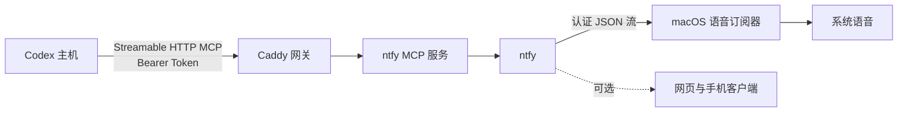

<div align="center">
  
  <h1>Let Agent Speak</h1>
  <p><strong>Your agent speaks when it’s done — or when it needs you.</strong></p>
  <p>运行在可信局域网里的私有、自托管 AI Agent 语音提醒桥接器。</p>

  <p>
    <a href="https://github.com/Seker800/LetAgentSpeak/actions/workflows/validate.yml"></a>
    <a href="LICENSE"></a>
    
    
  </p>

  <p><a href="README.md">English</a> · <a href="#快速开始">快速开始</a> · <a href="#安全模型">安全模型</a> · <a href="CONTRIBUTING.md">参与贡献</a></p>
</div>

---

Let Agent Speak 让可信局域网里的每台 AI Agent 主机都能用同一种简单方式提醒你：每个任务结束时，或 Agent 确实需要你介入时，服务端 Mac 会直接念出一条简短结果。不需要手机、不需要保持浏览器打开，也不依赖云通知账户。

它组合了三个职责清晰、可以替换的成熟组件：

- [ntfy](https://github.com/binwiederhier/ntfy)：保存和推送通知；
- [ntfy-mcp-server](https://github.com/cyanheads/ntfy-mcp-server)：向 Codex 暴露通知工具；
- [Caddy](https://github.com/caddyserver/caddy)：用 Bearer Token 保护局域网 MCP 入口。

## 为什么使用 Let Agent Speak？

- **任务执行时可以放心离开。** Codex 完成工作或需要你解除阻塞时，你会听到简短结果。
- **清晰的语音约定。** 附带的 Agent 策略定义有用的完成与阻塞消息，同时保持中间进度安静。
- **隐私优先。** 服务运行在自己的机器上；拒绝匿名访问；生成的凭据不会进入 Git。
- **覆盖多种 Codex 客户端。** Desktop、CLI 和 IDE 都通过标准 Streamable HTTP MCP 接入。
- **有独立兜底。** 若每个完成回合都必须提醒，可启用独立于模型工具调用的 Codex 完成 Hook。
- **组件保持解耦。** 语音订阅端只依赖 ntfy 的 HTTP 流，替换语音后端不需要改变 Codex 客户端。

## 工作方式



Caddy 是唯一对外发布的 MCP 入口。上游 MCP 容器只在 Docker 私有网络内可见；ntfy 则只允许一个自动生成的用户访问一个自动生成的主题。

## 快速开始

### 环境要求

- 一台在可信局域网内持续在线的 Mac
- Docker 与 Docker Compose
- `curl`、`jq` 和 `openssl`

克隆仓库并执行：

```bash
git clone https://github.com/Seker800/LetAgentSpeak.git
cd LetAgentSpeak
make init
make voice-install
```

`make init` 会自动检测 Mac 的局域网地址、生成随机凭据、启动固定版本的容器、配置最小权限 ntfy 访问、生成 Codex 客户端配置片段，并执行端到端冒烟测试。

`make voice-install` 会为当前 macOS 用户安装 LaunchAgent。它会自动重连、订阅私有主题，并通过 `/usr/bin/say` 朗读消息。

立即试听：

```bash
make voice-test
```

> [!WARNING]
> 默认部署使用 HTTP，只适合你信任的家庭或工作室局域网。不要在路由器上做公网端口映射。在不可信网络中，请使用 Tailscale/WireGuard 等 VPN，或可信的 HTTPS 反向代理。

## 连接 Codex

初始化后，把 `runtime/codex-config.toml` 的内容追加到每台 Codex 主机的 `~/.codex/config.toml`，然后重启对应 Codex 客户端。

再把 [`client/AGENTS.notification.md`](client/AGENTS.notification.md) 的策略加入该主机的全局 `~/.codex/AGENTS.md`。它为简短的完成结果、具体的阻塞提示、明确的提醒请求，以及中间和重复进度的静默行为提供稳定约定。用户明确要求安静时，该任务不会播报。

同一台主机上的 Codex Desktop、CLI 和 IDE 会共享 MCP 配置；其他局域网机器仍需各自配置一次。

## 可选的强制完成通知

MCP 工具由模型主动调用，不能保证每个回合都通知。若每个完成回合都必须提醒，可在对应主机安装 [`client/codex-notify.sh`](client/codex-notify.sh)，并配置：

```toml
notify = ["/absolute/path/to/codex-notify.sh"]
```

脚本从环境变量读取 `SEKER_NTFY_URL`、`SEKER_NTFY_TOPIC`、`SEKER_NTFY_USER` 和 `SEKER_NTFY_PASSWORD`。若已经存在 `notify` 命令，请用包装脚本依次调用两者，不要直接覆盖。

## 安全模型

| 边界 | 默认保护 |
| --- | --- |
| MCP 入口 | Caddy 要求自动生成的 256 位 Bearer Token |
| 上游 MCP 服务 | 仅位于 Docker 私有网络，不发布宿主机端口 |
| ntfy 访问 | 拒绝匿名访问；生成用户仅可访问一个随机主题 |
| 网络暴露 | 发布端口只绑定自动检测到的局域网地址 |
| 凭据 | 保存在已忽略的 `.env` 和 `runtime/` 文件，并使用限制性权限 |
| 依赖漂移 | 容器版本固定，升级前后执行检查 |

完整的信任边界和可靠性设计见 [`docs/ARCHITECTURE.md`](docs/ARCHITECTURE.md)。发现漏洞时，请按 [`SECURITY.md`](SECURITY.md) 私下报告，不要创建公开 Issue。

## 配置

只有自动检测的局域网地址不合适时，才需要手动从 `.env.example` 创建 `.env`；通常 `make init` 会自动生成。

| 变量 | 用途 | 默认值 |
| --- | --- | --- |
| `LAN_HOST` | 发布端口绑定的局域网地址 | 自动检测 |
| `MCP_PORT` | 认证 MCP 网关端口 | `3010` |
| `NTFY_PORT` | ntfy 订阅端口 | `8080` |
| `NTFY_UPSTREAM_BASE_URL` | 用于及时送达 iOS 的可选上游轮询中继 | 空 |
| `SEKER_VOICE` | 已安装的 macOS 系统声音 | `Tingting` |
| `SEKER_VOICE_RATE` | 80 到 500 的语速 | `190` |

用 `say -v '?'` 查看已安装声音。修改声音或语速后，重新运行 `make voice-install`。

### iPhone 送达

纯局域网自托管在 iPhone 锁屏后可能延迟。如需及时推送，可设置：

```dotenv
NTFY_UPSTREAM_BASE_URL=https://ntfy.sh
```

然后执行 `make up`。上游只会收到轮询请求，不会收到通知正文；手机仍需能够访问局域网内的 ntfy 服务。

## 常用命令

| 命令 | 用途 |
| --- | --- |
| `make status` | 查看容器状态 |
| `make logs` | 持续查看服务日志 |
| `make check` | 检查 Shell 语法、Compose 配置和秘密排除规则 |
| `make smoke` | 验证认证、MCP 握手、发送与回读 |
| `make client-config` | 重新生成 Codex 配置片段 |
| `make voice-status` | 检查 macOS 语音订阅器 |
| `make voice-test` | 发布语音测试消息 |
| `make voice-uninstall` | 删除语音 LaunchAgent |
| `make down` | 停止容器 |

## 项目原则

Let Agent Speak 会刻意保持小而清晰：容易部署、默认私密、足以支撑长时间 Agent 工作，并与单一客户端或通知平台保持低耦合。完整产品方向见 [`docs/NORTH_STAR.md`](docs/NORTH_STAR.md)。

## 参与贡献

欢迎提交 Bug、文档改进和范围清晰的 Pull Request。请先阅读 [`CONTRIBUTING.md`](CONTRIBUTING.md)，并遵守 [`CODE_OF_CONDUCT.md`](CODE_OF_CONDUCT.md)。

## 致谢

Let Agent Speak 是建立在 [ntfy](https://github.com/binwiederhier/ntfy)、[ntfy-mcp-server](https://github.com/cyanheads/ntfy-mcp-server) 和 [Caddy](https://github.com/caddyserver/caddy) 之上的集成项目，感谢这些项目的出色工作。

## 许可证

本项目采用 [MIT License](LICENSE) 开源。
