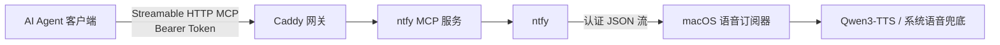

<div align="center">
  
  <h1>Let Agent Speak</h1>
  <p><strong>Your agent speaks when it’s done — or when it needs you.</strong></p>

  <p>
    <a href="https://github.com/Seker800/LetAgentSpeak/actions/workflows/validate.yml"></a>
    <a href="LICENSE"></a>
    
    
  </p>

  <p><a href="README.md">English</a> · <a href="#快速开始">快速开始</a> · <a href="#安全模型">安全模型</a> · <a href="CONTRIBUTING.md">参与贡献</a></p>
</div>

---

跑 Agent 任务时，人不用一直盯着窗口。任务做完了，或者确实有一步需要你操作，Mac 会直接念出一句话。

Let Agent Speak 支持 Codex、Claude Code、OpenClaw，以及其他支持 Streamable HTTP MCP 的客户端。所有服务都跑在你自己的局域网里：

- [ntfy](https://github.com/binwiederhier/ntfy) 负责送消息；
- [ntfy-mcp-server](https://github.com/cyanheads/ntfy-mcp-server) 给 Agent 提供发送工具；
- [Caddy](https://github.com/caddyserver/caddy) 检查访问令牌。

## 为什么用它

- **不用盯着 Agent。** 完成、失败或需要你操作时，Mac 会直接告诉你结果。
- **中文更自然。** Apple Silicon Mac 可选用本地 Qwen3-TTS，不需要把朗读文本发到云端。
- **不会一直占内存。** 模型空闲 20 分钟后自动退出，下一条通知到来时再唤醒。
- **故障可退化。** Qwen 启动或生成失败时自动使用 macOS `say`，通知链路不会被模型拖死。
- **客户端解耦。** Codex、Claude Code、OpenClaw 和通用 MCP 客户端使用同一个通知入口。
- **默认私密。** MCP 有 Bearer Token，ntfy 使用最小权限主题，TTS 端口仅监听本机。

## 工作方式



Agent 调用一个 MCP 工具，ntfy 把文字交给 Mac 上的后台服务。订阅器先清理 Markdown、链接和文件路径，再交给本地 Qwen3-TTS；神经语音不可用时会自动回退到 macOS `say`。局域网里只开放 Caddy 这一层 MCP 入口，语音模型端口只绑定本机回环地址。

## 快速开始

### 环境要求

- 一台在可信局域网内持续在线的 Mac
- Docker 与 Docker Compose
- `curl`、`jq` 和 `openssl`
- Apple Silicon（仅 Qwen3-TTS 需要；系统语音模式不需要）

克隆仓库并执行：

```bash
git clone https://github.com/Seker800/LetAgentSpeak.git
cd LetAgentSpeak
make init
make voice-ai-install
make voice-install
```

`make init` 会找到 Mac 的局域网地址、生成凭据、启动容器、写出 Codex 配置片段，并检查整条链路。其他 Agent 使用同一个 MCP 地址和令牌，只是配置格式不同。

`make voice-ai-install` 会在 Apple Silicon Mac 上编译并下载固定版本的本地 Qwen3-TTS（约 2.4 GB 模型文件）。`make voice-install` 安装语音订阅器；默认优先 Qwen，异常时自动用 `/usr/bin/say` 兜底。Qwen 在 20 分钟没有朗读后自动退出，下一条消息会自动唤醒它。如不需要神经语音，可跳过 `make voice-ai-install`。

立即试听：

```bash
make voice-test
```

> [!WARNING]
> 默认部署使用 HTTP，只适合你信任的家庭或工作室局域网。不要在路由器上做公网端口映射。在不可信网络中，请使用 Tailscale/WireGuard 等 VPN，或可信的 HTTPS 反向代理。

## 本地语音开销

默认安装固定版本的 `Qwen3-TTS-12Hz-0.6B-CustomVoice`。以下数据来自一台 64 GB M4 Pro Mac，其他机器会有所不同。

| 指标 | 实测值 |
| --- | --- |
| 模型磁盘占用 | 约 2.4 GB |
| 模型运行内存 | 约 5.5 GB |
| 热状态生成 | 约 1.1–1.2 秒生成 3.8–3.9 秒中文音频 |
| 休眠后唤醒 | 约 4 秒 |
| 自动休眠 | 20 分钟无朗读后释放模型内存 |

Qwen 不通过 Ollama 运行；项目会编译固定版本的原生 Apple Silicon 运行时。这样可以控制监听范围、启动参数、日志隐私和自动休眠行为。

## 让 Agent 帮你安装

直接对 Agent 说：

> 按照仓库里的说明部署并验证 Let Agent Speak。

[`AGENTS.md`](AGENTS.md) 会告诉它去哪里找部署步骤，以及 Codex、Claude Code、OpenClaw 分别该怎么配置。检查没跑完之前，不应该把任务报成完成。

不要把 `.env` 或 `runtime/codex-config.toml` 粘贴到聊天或 Issue 里，里面有凭据。

## 连接 Agent

MCP 连接和“什么时候开口”的规则分开配置：

| 客户端 | MCP 作用域 | 持久策略位置 |
| --- | --- | --- |
| Codex | 用户级 `~/.codex/config.toml` | `~/.codex/AGENTS.md` |
| Claude Code | 用户级 MCP | `~/.claude/rules/seker-call-me.md` |
| OpenClaw | 中央 `mcp.servers` 注册表 | 每个 Agent workspace 的 `AGENTS.md` |
| 其他 MCP 客户端 | 最接近的用户/全局作用域 | 最接近的持久指令作用域 |

部分机器内部标识仍保留历史名称 `seker_call_me` 或 `seker-call-me`。这是为了让已有安装原地升级，避免产生重复服务。

每种客户端的命令和检查方法见 [`docs/AGENT_CLIENTS.md`](docs/AGENT_CLIENTS.md)。播报规则在 [`client/AGENTS.notification.md`](client/AGENTS.notification.md)。

### Codex 快速路径

把 `runtime/codex-config.toml` 合并进 `~/.codex/config.toml`，然后重启 Codex。

再把 [`client/AGENTS.notification.md`](client/AGENTS.notification.md) 合并进全局 `~/.codex/AGENTS.md`，不要覆盖原来的内容。

同一台 Mac 上的 Codex Desktop、CLI 和 IDE 共用这份配置。其他机器需要各自配置一次。

## 可选的 Codex 强制完成通知

Agent 可能忘记调用 MCP 工具。如果你要求 Codex 每个完成回合都必须提醒，可以安装 [`client/codex-notify.sh`](client/codex-notify.sh)，并在 `~/.codex/config.toml` 里加入：

```toml
notify = ["/absolute/path/to/codex-notify.sh"]
```

在启动 Codex 的环境里设置 `SEKER_NTFY_URL`、`SEKER_NTFY_TOPIC`、`SEKER_NTFY_USER` 和 `SEKER_NTFY_PASSWORD`。脚本会朗读最终回复的第一条非空内容。如果你已经配置了 `notify`，用包装脚本依次调用两者。

## 安全模型

| 边界 | 默认保护 |
| --- | --- |
| MCP 入口 | Caddy 要求自动生成的 256 位 Bearer Token |
| 上游 MCP 服务 | 仅位于 Docker 私有网络，不发布宿主机端口 |
| ntfy 访问 | 拒绝匿名访问；生成用户仅可访问一个随机主题 |
| 网络暴露 | 发布端口只绑定自动检测到的局域网地址 |
| 本地 TTS | 只绑定 `127.0.0.1`；关闭浏览器跨域；日志不记录朗读正文 |
| 凭据 | 保存在已忽略的 `.env` 和 `runtime/` 文件，并使用限制性权限 |
| 依赖漂移 | 容器版本固定，升级前后执行检查 |

更多细节见 [`docs/ARCHITECTURE.md`](docs/ARCHITECTURE.md)。安全问题请按 [`SECURITY.md`](SECURITY.md) 私下报告，不要发公开 Issue。

## 配置

只有自动检测的局域网地址不合适时，才需要手动从 `.env.example` 创建 `.env`；通常 `make init` 会自动生成。

| 变量 | 用途 | 默认值 |
| --- | --- | --- |
| `LAN_HOST` | 发布端口绑定的局域网地址 | 自动检测 |
| `MCP_PORT` | 认证 MCP 网关端口 | `3010` |
| `NTFY_PORT` | ntfy 订阅端口 | `8080` |
| `SEKER_VOICE` | 已安装的 macOS 系统声音 | `Tingting` |
| `SEKER_VOICE_RATE` | 80 到 500 的语速 | `170` |
| `SEKER_SPEECH_PROVIDER` | `auto`、`qwen` 或 `say` | `auto` |
| `SEKER_QWEN_TTS_VOICE` | Qwen 内置说话人 | `vivian` |
| `SEKER_QWEN_TTS_RATE` | Qwen 语速倍率 | `1.0` |
| `SEKER_QWEN_TTS_THREADS` | 本地生成线程数（M4 Pro 默认） | `8` |
| `SEKER_QWEN_TTS_IDLE_SECONDS` | 无朗读后释放模型内存的秒数 | `1200` |

用 `say -v '?'` 查看已安装的系统声音。修改订阅器、说话人或语速设置后运行 `make voice-install`；修改 Qwen 端口、线程或休眠设置后运行 `make voice-ai-install`。

## 常用命令

| 命令 | 用途 |
| --- | --- |
| `make status` | 查看容器状态 |
| `make logs` | 持续查看服务日志 |
| `make check` | 检查 Shell 语法、Compose 配置和秘密排除规则 |
| `make smoke` | 验证认证、MCP 握手、发送与回读 |
| `make client-config` | 重新生成 Codex 配置片段 |
| `make voice-status` | 检查 macOS 语音订阅器 |
| `make voice-ai-install` | 安装并注册按需启动的本地 Qwen3-TTS |
| `make voice-ai-status` | 查看 Qwen3-TTS 正在运行还是已休眠 |
| `make voice-ai-uninstall` | 停止 Qwen3-TTS，保留已下载模型 |
| `make voice-test` | 发布语音测试消息 |
| `make voice-uninstall` | 删除语音 LaunchAgent |
| `make down` | 停止容器 |

## 参与贡献

欢迎提 Issue 和 Pull Request，动手前请先看 [`CONTRIBUTING.md`](CONTRIBUTING.md)。

## 致谢

项目使用了 [Qwen3-TTS](https://huggingface.co/Qwen/Qwen3-TTS-12Hz-0.6B-CustomVoice)、[qwen3-tts 原生运行时](https://github.com/gabriele-mastrapasqua/qwen3-tts)、[ntfy](https://github.com/binwiederhier/ntfy)、[ntfy-mcp-server](https://github.com/cyanheads/ntfy-mcp-server) 和 [Caddy](https://github.com/caddyserver/caddy)。

## 许可证

本项目采用 [MIT License](LICENSE) 开源。
